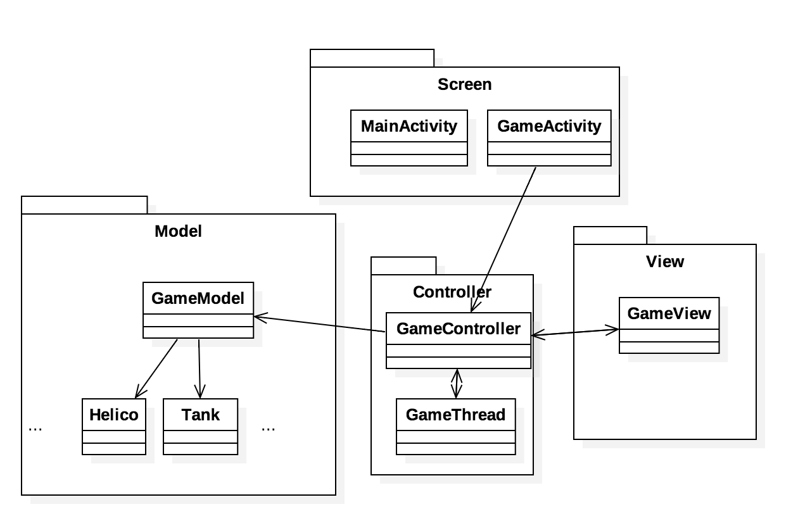

# Projet développement mobile 2015-2016 : Choplifter Reboot

<a href="https://fr.wikipedia.org/wiki/Choplifter">Choplifter</a> est un jeu sorti en 1982 sur Apple ][ puis porté sur différents systèmes.
Le but de ce projet est de réaliser un clone de ce jeu pour le système Android.

Une version Flash de ce jeu (Sega Master System) est disponible : <http://game-oldies.com/play-online/choplifter-sega-master-system>

La version dont on s'inspire dans ce projet est la version Commodore 64. Un émulateur C64 est disponible ici : <http://vice-emu.sourceforge.net/> (il en existe d'autres). La ROM de Choplifter : <a href="rom/CHOPLIFT.PRG">Choplifter C64</a>.

Pour les éléments graphiques, vous pourrez vous servir de captures d'écran et d'un logiciel de dessin (suggestion : <http://www.piskelapp.com/>).

Des exemples de bitmaps pour démarrer sont donnés dans le dossier `assets/`

## Architecture MVC

Le code sera structuré selon une architecture MVC (Modèle-Vue-Contrôleur).

Le contrôle de l'hélicoptère pourra se faire, au choix du joueur, avec les méthodes suivantes :

- Toucher : l'hélicoptère se déplace vers le pointeur. Une zone dédiée sur la surface de jeu (boutons ou autre) permet à l'hélicoptère de tirer et de changer sa position.
- Pad virtuel : un pad virtuel est superposé à la surface de jeu.
- Gyroscope : l'hélicoptère est dirigé par inclinaison de la tablette ou du téléphone. 


Le score est géré et enregistré à la fin de la partie.
	
### Définition des packages

Une bonne pratique consiste à placer les vues Android (en général toutes les activités, les fragments, etc.) dans un package **screen**.
Les classes modèles, vues et contrôleurs seront placées dans les trois packages **model**, **view**, **controller** (deux *l* à **controller** !).

	
### Définition des écrans

L'application comportera au minimum deux activités qui correspondront aux deux écrans principaux de l'application : 

- Un menu permettant de gérer les options (persistantes), voir les meilleurs scores, les crédits et lancer le jeu (classe ``MainActivity``).
- La vue principale du jeu (classe ``GameActivity``) 

	

### Définition du modèle

La classe ``GameModel`` contient les classes métier, c'est à dire l'ensemble des éléments du jeu (positions, vitesse, type des différents sprites, etc.).
Tous les éléments du modèle sont complètement indépendants de l'affichage, et peuvent être réutilisés tels quels dans un autre projet utilisant éventuellement un autre type d'affichage.

	
### Définition du contrôleur

Le contrôleur est le chef d'orchestre : il contrôle la mise à jour de la vue à partir du modèle, la mise à jour du modèle, la réponse aux évènements.
Toute la logique de jeu est contenue dans la partie contrôleur

- ``GameController`` : possède une référence vers un objet ``GameModel`` et ``GameView``. Met à jour la vue en fonction du modèle et des interactions utilisateurs. Possède une référence vers la classe ``GameThread``
- ``GameThread`` : le thread exécutant la boucle de jeu. 

			
### Définition de la vue	
La vue principale du jeu :
 
- ``GameView`` : dérive de la classe `View`. Définit l'ensemble des méthodes relatives à l'affichage, ainsi que la gestion des évènements.
				Possède une référence vers la classe contrôleur.

### Modélisation UML
La modélisation UML correspondante est la suivante :
	  
	

## Mise en oeuvre
Ceci est une  *proposition* pour vous aider à démarrer le projet.

### Activités : package screen

- Créer les deux principales activités (`MainActivity`et `GameActivity`).

- Pour éviter le changement automatique de vue par rotation de l'appareil, vous pouvez fixer une orientation pour l'activité ``GameActivity`` dans le manifest :

```xml
<activity
    android:name=".screens.GameActivity"
    android:label="@string/title_activity_gameActivity"
    android:configChanges="orientation|keyboardHidden|screenSize"
    android:screenOrientation="landscape" >            
</activity>
```

- Dans l'activité `GameActivity`, écrire la méthode `initGame()` qui :

	- instancie le contrôleur `GameController` (le constructeur prend en paramètre une référence vers le contexte de l'application, c'est à dire l'activité courante `GameActivity`qui dérive de `Activity` mais également de `Context`) ;
		
	- appelle la méthode `startGame()` du contrôleur pour lancer la boucle de jeu.
		
### Vue : package view 

La vue possède une référence vers le contrôleur, mais pas de référence vers le modèle pour respecter le paradigme MVC (découplage entre vue et modèle).

- Surcharger la méthode `public void onDraw(Canvas canvas)`. Cette méthode est appelée par le système à chaque rafraîchissement de la vue. Un appel à `View.invalidate()` permet de forcer le rafraîchissement. 
-  Le `Canvas` en paramètre nous donne une référence vers la surface de la vue courante : c'est sur cette surface que vont être dessinés tous les éléments graphiques. 
-  La classe `Canvas` possède des méthodes permettant de dessiner des primitives géométriques (`Canvas.drawCircle(...)`, `Canvas.drawRect(...)`,...) ou des bitmaps (`Canvas.drawBitmap(...)`)

- Définir la méthode `onTouchEvent(MotionEvent event)` qui sera appelée lors d'un évènement de type `touchEvent` :
		
```java
@Override
public boolean onTouchEvent(MotionEvent event) {
    //Log.d("View : ", "onTouchEvent");
    switch(event.getAction()) {
        case (MotionEvent.ACTION_MOVE) :
            //Log.d("View : ", "move " + event.getX() + " " +event.getY());
            int x=(int)event.getX();
            int y=(int)event.getY();
            // Envoi au contrôleur des coordonnées        
            controller.touchEvent(x,y);
            break;
        case (MotionEvent.ACTION_DOWN) :
            //Log.d("View : ", "move " + event.getX() + " " +event.getY());
             x=(int)event.getX();
             y=(int)event.getY();
            controller.touchEvent(x,y);
            break;
    }
    return true;
}
```
		
## Contrôleurs : package controller

- `GameController` possède une référence vers la vue et vers le modèle. Son rôle est :
	- d'instancier le modèle de jeu `GameModel` et d'instancier la vue `GameView`			
	- de créer la configuration initiale du jeu. 

Cette méthode pourra ressembler à ça :
	
```java
public void init() {
// permet de récuperer les dimensions de la vue
WindowManager wm = (WindowManager) context.getSystemService(Context.WINDOW_SERVICE);
Display display = wm.getDefaultDisplay();
Point size = new Point();
display.getSize(size);

// initialise le modèle de jeu à la taille de la vue (l'écran)
gameModel.init(size.x, size.y);
}
```
- La méthode `startGame()`, appelée à partir de l'activité `GameActivity` instancie et lance un nouveau thread de jeu : 

```java
public void startGame() {
  gameThread=new GameThread(this,gameModel,gameView);
  gameThread.start();
}
```
- La méthode `update()` est appelée à chaque boucle de jeu par le thread de jeu.
 Son rôle est de mettre à jour le modèle en fonction des évènements (interactions, collisions, physique des mouvements,...).
- la classe `GameThread` dérive de `Thread`. Cette classe définit le thread secondaire qui exécute en tâche de fond la boucle de jeu dans la méthode `run()`. Elle pourra ressembler à ça : 

```java
@Override
public void run() {
	long ticksPS = 10;
	long startTime;
	long sleepTime;
	while(isRunning) {
	    controller.update();
	    startTime = System.currentTimeMillis();
	    sleepTime = ticksPS-(System.currentTimeMillis() - startTime);
	    try {
	        if (sleepTime > 0)
	            sleep(sleepTime);
	        else
	            sleep(10);
	    } catch (Exception e) {}
	    view.postInvalidate();
	}
	controller.endGame();
}
```

- Très important : seul le thread principal (UI thread) peut mettre à jour l'interface graphique. Il faut donc faire appel à ``View.postInvalidate()`` pour mettre à jour la vue (un appel direct à `view.invalidate()`échoue). La méthode `View.postInvalidate()` permet de déléguer la mise à jour de la vue au thread UI.</li>

## Planning prévisionnel
1. Semaine 2 : mise en place de la structure générale. Création du menu principal, du menu de préférences. Création des premières classes modèle. Affichage de l'hélicoptère sur la vue de jeu. Implantation d'une méthode d'interaction  au choix permettant de diriger l'hélicoptère et de changer sa position (côté, face). 
2. Semaine 3 (22 février) : mise en place du background. Base, terrain. L'hélicoptère peut se poser. Amélioration de la physique de l'hélicoptère : accélération, vitesse. Classes modèle : civils, tanks, ... 
3. Semaine 4 (29 février) : génération procédurale (aléatoire) du jeu. Les civils se déplacent. L'hélicoptère peut tirer. Les tanks peuvent tirer. Gestion du score.
4. Semaine 5 (7 mars) : gestion des animations (explosions, pales de l'hélicoptère, les civils courent). Gestion des autres modes de contrôle. L'hélicoptère peut ramener les civils à la base.
5. Semaine 6 (14 mars) : gestion des musiques et des sons. Finitions.
6. Semaine 7 (21 mars) : tests, correction des derniers bugs.