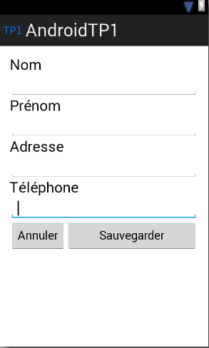
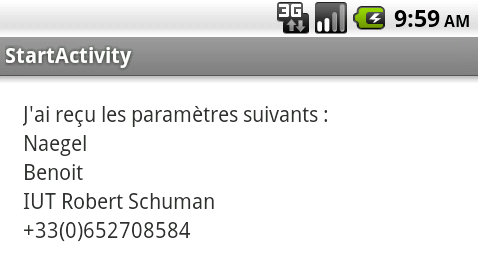

# Premier TP : prise en main du framework et d'Android Studio

## Instructions pour ce TP
- faire des commits réguliers et commentés à bon escient
- faire un push en fin de séance

## Application 1
Activité principale : l'utilisateur saisit son nom, prénom, numéro de téléphone. Un bouton "Effacer" permet d'effacer tous les champs.
Le bouton "Envoyer" permet d'envoyer les informations à une seconde Activité.
La seconde Activité réceptionne les données et les affiche de manière structurée à l'écran.
L'interface utilisateur utilise un layout de type LinearLayout et ressemble à ça :

La seconde Activité affichera les éléments envoyés :

## Application 2

- Récupérer une image de type boule (recherche Google Image). Afficher cette boule sur une vue personnalisée
<a href="http://developer.android.com/training/custom-views/index.html"> Custom View </a>.
- tant qu'un évenèment tactile est détecté, la boule se déplace en direction du pointeur

## Application 3

Reprendre l'application précédente : l'objectif est d'animer la boule.
Quand un évènement tactile est détecté, la boule se déplace en direction du pointeur, et conserve sa vitesse.
Quand la boule atteint le bord de l'écran, elle "rebondit" et change de direction.
